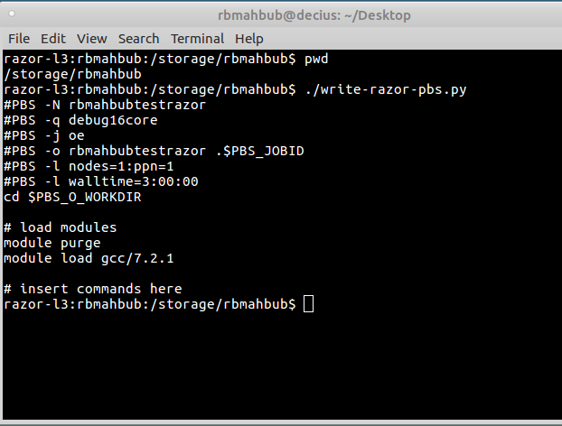

# BIOL5153
- #### CV1.md
CV1.md is my resume generated using R package pagedown.  

- #### CV2.md
CV2.md is my resume using R markdown.  

- #### assn03
assn03 consists of some blastn (blast/2.3.0+) searches to search watermelon nad4L nucleotide sequences.  

- #### write_razor_pbs.py
write_razor_pbs.py is a PBS python script to run in the razor cluster of AHPCC  

- #### write_pinnacle_slurm.py
write_pinnacle_slurm.py is a slurm python script to run in the pinnacle cluster of AHPCC  
- ###  Screenshot
screen shot that shows thepwdand script commands, followed by the output of the script.

- ### dna.txt
dna.txt contains the DNA sequence of nad4L

- ### nucleotide_composition.py
a python script that estimates the frequency of the Adenine,Thymine, Guanine and Cytosine  of the file dna.txt. 

- ### parseGFF.py
Assignment 6. Using csv, argparse and biopython packages parsing a GFF file and slicing and extracting the sequence from the genome.
